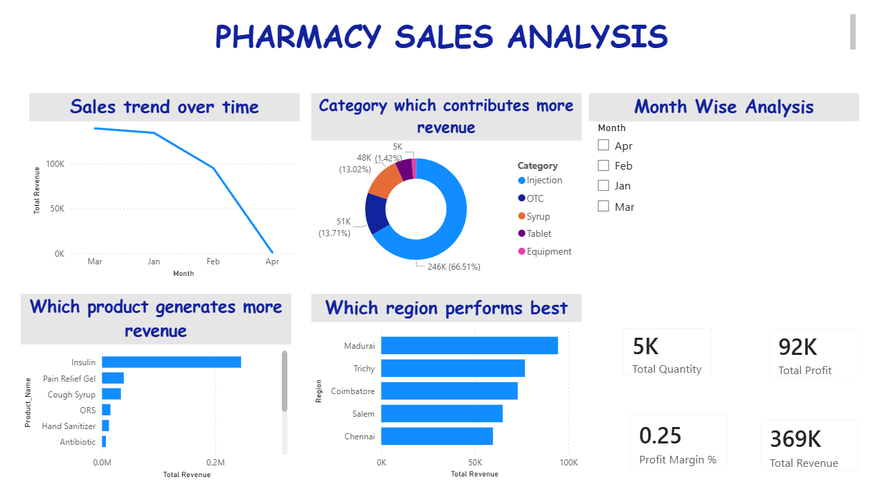

# 💊 Pharmacy Sales Analysis

## 📌 Project Overview
This project was completed as part of my internship at **Future Intern**, where I analyzed pharmacy sales data to extract meaningful insights and support business decision-making.

The analysis focuses on understanding revenue patterns, identifying profitable products, and analyzing trends across categories and regions.

---

## 🎯 Objective
- Analyze pharmacy sales and profit data  
- Identify top-performing products  
- Study sales trends over time  
- Determine profitable categories and regions  
- Provide insights for business growth  

---

## 🛠️ Tools & Technologies Used
- **Excel** – Data Cleaning & Preparation  
- **Power BI** – Data Visualization & Dashboard Creation  

---

## 📊 Dashboard Preview

---

## 📁 Project Files
- `Pharmacydataset.xlsx` → Raw dataset  
- `PHARMACYSALESANALYSIS.pbix` → Power BI dashboard file  
- `README.md` → Project documentation  

---

## 🔍 Key Insights
- Tablets generate the highest revenue  
- Chennai region has the highest sales  
- UPI is the most used payment method  
- Sales vary across different months and categories  

---

## 🚀 Business Recommendations
- Focus on high-demand and high-revenue products  
- Improve performance in low-sales regions  
- Use seasonal trends for better stock management  
- Promote high-margin products  

---

## ⚠️ Note
The Power BI file (`.pbix`) cannot be viewed directly in GitHub.  
To explore the dashboard:
1. Download the file  
2. Open it using **Power BI Desktop**

---

## 🌐 Project Link
👉 https://github.com/ramya14devops/FUTURE_DS_01  

---

## 🙌 Acknowledgement
I would like to thank **Future Intern** for providing this opportunity to work on a real-world data analysis project and enhance my practical skills.

---

## 📌 Conclusion
This project helped me improve my skills in:
- Data Cleaning  
- Data Visualization  
- Insight Generation  
- Dashboard Design  

I look forward to applying these skills in future data-driven projects.

---

# 📢 Connect with me
Feel free to explore, provide feedback, and connect!
